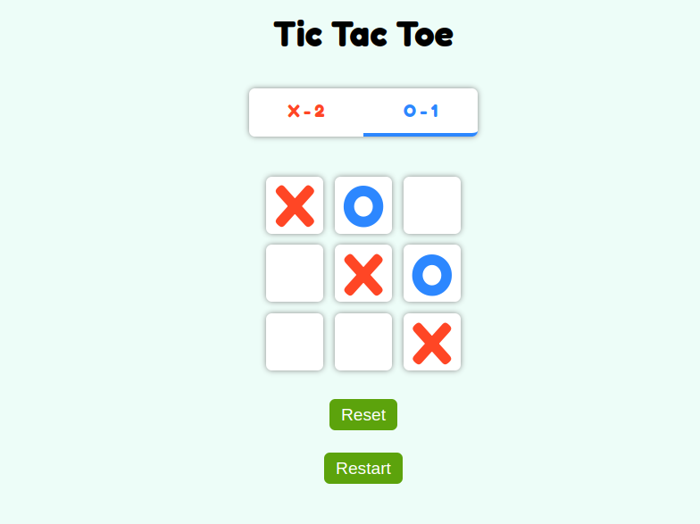

# Tic-Tac-Toe Game

This is a simple two-player Tic-Tac-Toe game implemented in React.js.

## Deployed Link: https://tic-tac-toe-tau-sandy-26.vercel.app/

## Features

- Two players can play Tic-Tac-Toe.
- Players are represented by blue (Player 1) and red (Player 2) markers.
- Scores of each player are displayed at the top of the game board.
- User scores are persisted even after the page is reloaded.
- Includes a reset button to clear the current game state.
- Includes a restart button to start a new game.

## Technologies Used

- React.js
- JavaScript (ES6+)
- CSS (for styling)
- LocalStorage (for persisting scores)

## Setup

To run this project locally, follow these steps:

1. Clone the repository: `git clone https://github.com/MOHDSAMIULLAH/Tic-Tac-Toe.git`
2. Navigate to the project directory: `cd tic-tac-toe`
3. Install dependencies: `npm install`
4. Start the development server: `npm start`
5. Open `http://localhost:3000` in your browser.

## Gameplay Instructions

- The game board is a 3x3 grid.
- Players take turns marking empty cells.
- The first player to get three of their marks in a row (horizontally, vertically, or diagonally) wins the game.
- If all cells are filled and no player has three marks in a row, the game ends in a draw.

## Screenshots

